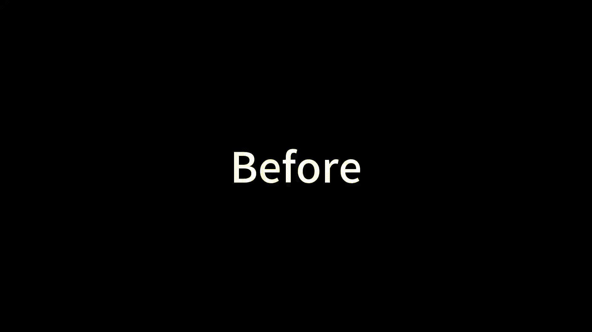
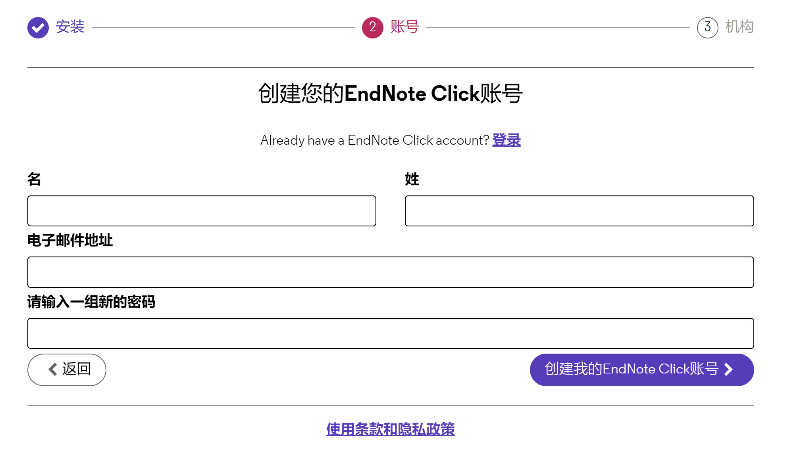
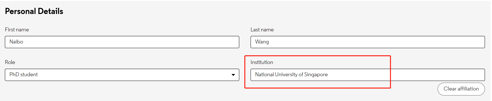

# NUS Literature Quick Access
For National University of Singapore's students and staffs, just with one single click you can open any papers without the need to login, input password, click Accept buttion and click many many times of web links.

# Demo

## Before using this tool, you need to click many times to get the final pdf:

## After using this tool, just click once and you will see the pdf and download it:

# Installation

## 1. Install Tampermonkey:
https://chrome.google.com/webstore/detail/tampermonkey/dhdgffkkebhmkfjojejmpbldmpobfkfo

## 2. Install Endnote Click:
https://chrome.google.com/webstore/detail/endnote-click-formerly-ko/fjgncogppolhfdpijihbpfmeohpaadpc?hl=en

## 3. Register Endnote Click with institution specified as $National$ $University$ $of$ $Singapore$:

## 4.1 For NUS Ph.D. Students, install the following  TamperMonkey Script:

https://greasyfork.org/en/scripts/453866-automatically-literature-validation-for-nus-ph-d-student-%E6%96%B0%E5%8A%A0%E5%9D%A1%E5%9B%BD%E7%AB%8B%E5%A4%A7%E5%AD%A6%E8%87%AA%E5%8A%A8%E6%96%87%E7%8C%AE%E9%AA%8C%E8%AF%81%E8%87%AA%E5%8A%A8%E7%99%BB%E5%BD%95%E8%84%9A%E6%9C%AC

## 4.2 For NUS Staffs, install the following TamperMonkey Script:

https://greasyfork.org/en/scripts/453867-automatically-literature-validation-for-nus-staff-%E6%96%B0%E5%8A%A0%E5%9D%A1%E5%9B%BD%E7%AB%8B%E5%A4%A7%E5%AD%A6%E8%81%8C%E5%B7%A5%E8%87%AA%E5%8A%A8%E6%96%87%E7%8C%AE%E9%AA%8C%E8%AF%81%E8%87%AA%E5%8A%A8%E7%99%BB%E5%BD%95%E8%84%9A%E6%9C%AC

## 5. Enjoy it!