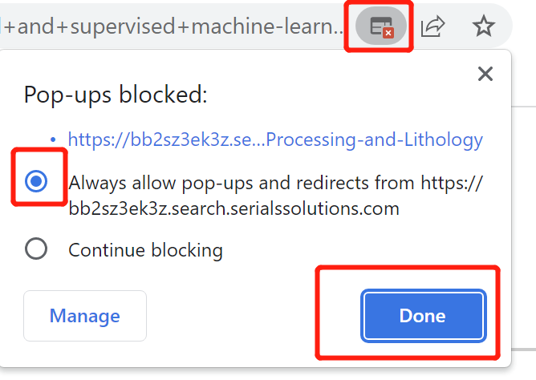
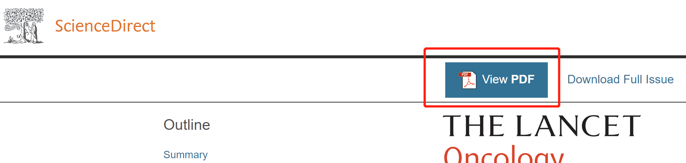

# NUS Literature Quick Access
For National University of Singapore's students and staffs, just with one single click you can open any paper without the need to manually login, input password, click $Login$ and $Accept$ button or click many many times of web links. Works for all NUS Staffs and Students.

## Update

New version is fit for new NUS Login Interface and we added **all 300+ literature databases** from NUS library!

# Acknowledgement

Thanks to Dr. Shengliang Lu's original script [@lushl9301](https://github.com/lushl9301/Auto-Paper-Access)
 in the development of this project.

# Demo (If the animation does not play automatically, click the $Play$ button in the upper right corner of the picture to play it)

## Before using this tool, you need to click many times to get the final pdf (and this is even the version you already configured the NUS library link):

## After using this tool, just click once and you will see the pdf and download it:

# Installation

## 1. Install Tampermonkey:

[Click here to install Tampermonkey](https://chrome.google.com/webstore/detail/tampermonkey/dhdgffkkebhmkfjojejmpbldmpobfkfo){:target="_blank"}

## 2. Install Script by clicking the following link:

(CLick here to install Script)[https://greasyfork.org/en/scripts/453867-automatically-literature-validation-for-nus-%E6%96%B0%E5%8A%A0%E5%9D%A1%E5%9B%BD%E7%AB%8B%E5%A4%A7%E5%AD%A6%E8%87%AA%E5%8A%A8%E6%96%87%E7%8C%AE%E9%AA%8C%E8%AF%81%E8%87%AA%E5%8A%A8%E7%99%BB%E5%BD%95%E8%84%9A%E6%9C%AC"]{:target="_blank" rel="noopener"}

## 3. Enjoy!

See the next section for more details to get and download PDFs at various journal websites.
<!-- Then every time in the future, you just need to enter the paper detail page and click the **View PDF** button in the *Left Bottom* Corner of the current web page and then you can download the pdf at the *Top Right* Corner.

After test, this tool along with $Endnote$ extension worked for websites like **IEEE, ACM Digital Library, Springer, etc.**, basically most mainstream literature websites. -->

## (Optional) 4. Let your browser save and autofill your password:

Open any paper detail page (such as: https://ieeexplore.ieee.org/abstract/document/8737464), and wait the page to automatically pop up the login page, **input your username and password**:

Sometimes the popup webpages may be like this, just input your username (without nusstu/ or nusttf/) and password only once every time you open a new browser:.

Then, **let the browser save your password**.

## (Optional) 5. Install Endnote Click:

If you choose not to install Endnote Click, you will need to click two more times of mouse to download the pdf for 15% of the journals (mostly not mainstream), but mainstream journals are not affected even you don't install (such as IEEE, ACM, etc).

Click here to install endnote click:

https://chrome.google.com/webstore/detail/endnote-click-formerly-ko/fjgncogppolhfdpijihbpfmeohpaadpc?hl=en

## (Optional) 6. Register and Login Endnote Click with institution specified as $National$ $University$ $of$ $Singapore$  (Optional):

# Use Cases

## 1. For IEEE Xplore, ACM Digital Library, Springer Link, Science Direct, Nature, etc (mainstream journals/conferences):

Just open the detail page, wait for 3 seconds and click the **View PDF** button to get and download the pdf (you only need to login once when you first open your browser, and the login process can also be automated, as long as you follow the instruction of this tool).

## 2. For some unpopular journals, click the **View PDF** button at the left bottom corner of the detailed page to get and download the pdf （This requires install the endnote extension）:

If you didn't install EndNote Click, skip this way and see way 3.

E.g., https://ascelibrary.org/doi/abs/10.1061/%28ASCE%29CO.1943-7862.0001736

Also, you can click the **View PDF** button at any page as long as the button appears such as in IEEE, ACM, etc.

The EndNote extension will help you to save all papers you have browsed to your EndNote library, so it is convenient for you to manage your papers, if you like.

## 3. If both way 1 and way 2 don't work, you will need to click the **Find it! @NUS Library** at the **Google Scholar** page to login and download the pdf:

E.g., https://onepetro.org/SJ/article-abstract/25/05/2778/454145/Automated-Well-Log-Processing-and-Lithology

Below are instructions about how to add the **Find it! @NUS Library** button to your Google Scholar page:

### 1. Add "NUS" to your Google Scholar Library Links (can just click the following link):

https://scholar.google.com/scholar_settings?sciifh=1&hl=en&as_sdt=0,5#2

### 2. Search the paper that needs to be downloaded at **Google Scholar** page:

And you will find a link text of **Find it! @NUS Library**, click it:

### 3. Click the **Click to get Full Text** button (or Read Chapter button, depends on the paper contents):

This button will be automatically clicked by this tool, but some browser may block the popup window, so you need to allow the popup window to be opened:

Or you can just manually click the button every time you open it.

### 4. Then you will have two options to open the final pdf:

### 4.1 Manually click the login button every time you open the browser (but as long as you don't close the browser, the process will appear only once):

And this tool with automatically help you to click the **Accept** button in the following page.

### 4.2 Save your username and password at the TamperMonkey Script and then you don't need to click the **Login** button every time.

If you choose to save your username and password into the script, then you don't need to click the **Login** button every time, and the tool will help you to automatically click the **Accept** button too.

To do this, click the TamperMonkey icon in the upper right corner of the browser, and click the **NUS Literature Quick Access** script, and then click the **Edit** button:

Then you will see the following page, **modify the username and password variables to your own username and password**: (Note: the username is your NUSNET ID, not the NUSNET email address)

Click the **Save** button:

Then after you click the **Click to get Full Text** button, the tool will help you to automatically click the **Accept** button.

### 4.3 Then you can click the **View PDF** button at the top center of the page (or somewhere else, depends on the specific journal website):

And you can open and download the pdf page thereafter.

# Other Notes

- Every time you open the browser, you may need to login once, but as long as you don't close the browser, you don't need to login again.

- If you want to use this tool in other browsers, you need to repeat the installation process again.

