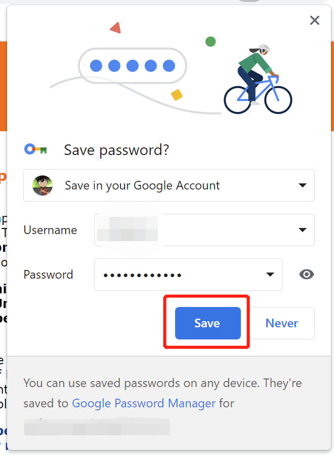
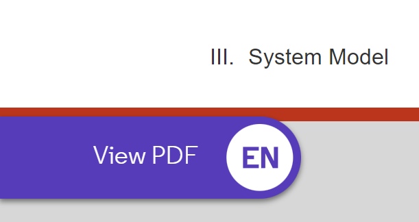
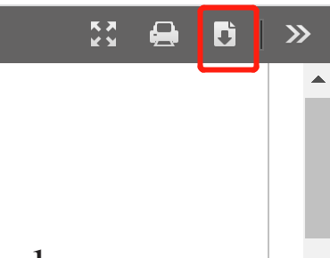
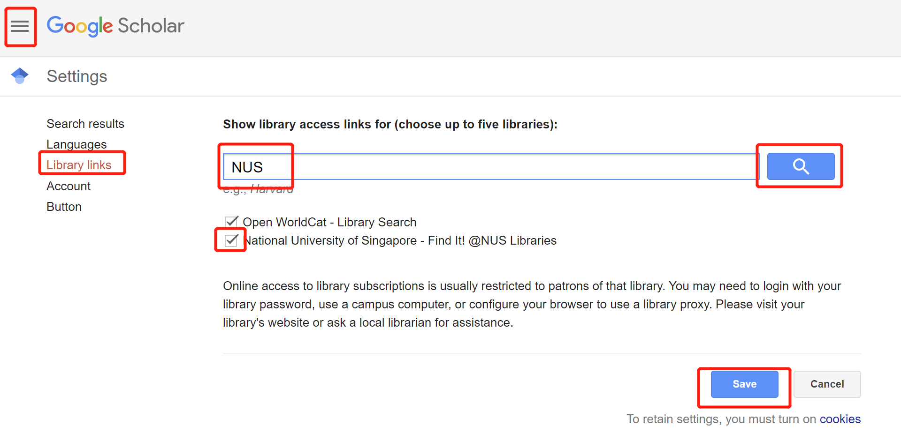
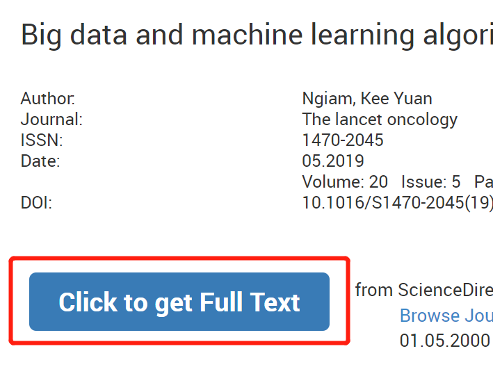

# NUS Literature Quick Access
For National University of Singapore's students and staffs, just with one single click you can open any papers without the need to manually login, input password, click $Login$ and $Accept$ button or click many many times of web links.

# Demo (If the animation does not play automatically, click the Play button in the upper right corner of the picture to play it)

## Before using this tool, you need to click many times to get the final pdf:

## After using this tool, just click once and you will see the pdf and download it:

# Installation

## 1. Install Tampermonkey:
https://chrome.google.com/webstore/detail/tampermonkey/dhdgffkkebhmkfjojejmpbldmpobfkfo

## 2. Install Endnote Click:
https://chrome.google.com/webstore/detail/endnote-click-formerly-ko/fjgncogppolhfdpijihbpfmeohpaadpc?hl=en

## 3. Register Endnote Click with institution specified as $National$ $University$ $of$ $Singapore$:

## 4.1 For NUS Ph.D. Students, install the following  TamperMonkey Script:

https://greasyfork.org/en/scripts/453866-automatically-literature-validation-for-nus-ph-d-student-%E6%96%B0%E5%8A%A0%E5%9D%A1%E5%9B%BD%E7%AB%8B%E5%A4%A7%E5%AD%A6%E8%87%AA%E5%8A%A8%E6%96%87%E7%8C%AE%E9%AA%8C%E8%AF%81%E8%87%AA%E5%8A%A8%E7%99%BB%E5%BD%95%E8%84%9A%E6%9C%AC

## 4.2 For NUS Staffs, install the following TamperMonkey Script:

https://greasyfork.org/en/scripts/453867-automatically-literature-validation-for-nus-staff-%E6%96%B0%E5%8A%A0%E5%9D%A1%E5%9B%BD%E7%AB%8B%E5%A4%A7%E5%AD%A6%E8%81%8C%E5%B7%A5%E8%87%AA%E5%8A%A8%E6%96%87%E7%8C%AE%E9%AA%8C%E8%AF%81%E8%87%AA%E5%8A%A8%E7%99%BB%E5%BD%95%E8%84%9A%E6%9C%AC

## 5. Let your browser to save and autofill your password:

Enter any paper detail page (such as: https://ieeexplore.ieee.org/abstract/document/8737464), and wait the page to automatically pop up the login page, **input your username and password**:

Sometimes the popup webpages may be like this, just input your username (without nusstu/ or nusttf/) and password only once every time you open a new browser:.

Then, **let the browser the save your password**, so that you don't need to input your password in the future every time and the tool will help you to automatically click the $Login$ and $Accept$ button.

## 5. Enjoy!

Then every time in the future, you just need to enter the paper detail page and click the **View PDF** button in the Left Bottom Corner of the current web page and then you can download the pdf and the Top Right Corner.

After test, this tool along with Endnote work for websites like **IEEE, ACM Digital Library, Springer, etc.**, basically most main-stream literature websites.

# For websites like *ScienceDirect* that cannot direct open PDF by this tool and Endnote:

Some websites (very few but like *ScienceDirect/Elsevier* or some small journals) may not show the **View PDF** button at the left bottom corner of the page, then you need to do the following to quickly open and download the PDF.

## 1. Add "NUS" to your Google Scholar Library Links (Can just click the following link):

https://scholar.google.com/scholar_settings?sciifh=1&hl=en&as_sdt=0,5#2

## 2. Search the paper that needs to be downloaded at **Google Scholar** page:

And you will find a link text of **Find it! @NUS Library**, click it:

## 3. Click the **Click to get Full Text** button:

## 4. Then you will have two options to open the final pdf:

### 4.1 Manually click the login button every time:

And this tool with automatically help you to click the **Accept** button in the following page.

### 4.2 Save your user name and password at the TamperMonkey Script and then you don't need to click the **Login** button every time.

If you choose to save your username and password into the script, then you don't need to click the **Login** button every time, and the tool will help you to automatically click the **Accept** button too.

To do this, click the TamperMonkey icon in the upper right corner of the browser, and click the **NUS Literature Quick Access** script, and then click the **Edit** button:

Then you will see the following page, **modify the username and password variables to your own username and password**: (Note: the username is your NUSNET ID, not the NUSNET email address)

Click the **Save** button, and then you can enjoy the tool:

# Other Notes

- Every time you open the browser, you may need to login once, but as long as you don't close the browser, you don't need to login again.

- If you want to use this tool in other browsers, you need to repeat the installation process again.

